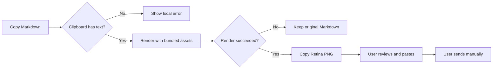

# Local render workflow

```mermaid
flowchart LR
    A[Copy Markdown] --> B{Clipboard has text?}
    B -->|No| C[Show local error]
    B -->|Yes| D[Render with bundled assets]
    D --> E{Render succeeded?}
    E -->|No| F[Keep original Markdown]
    E -->|Yes| G[Copy Retina PNG]
    G --> H[User reviews and pastes]
    H --> I[User sends manually]
```

Nothing is uploaded or sent automatically.
