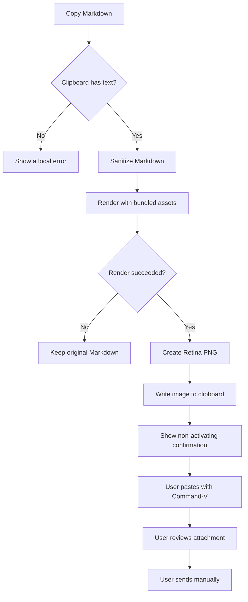
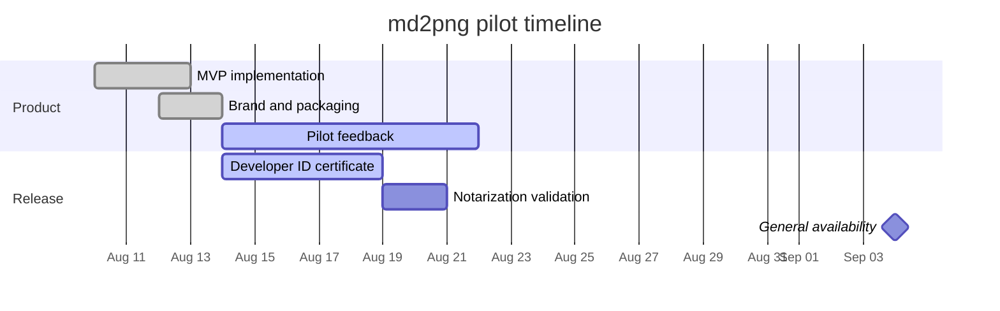
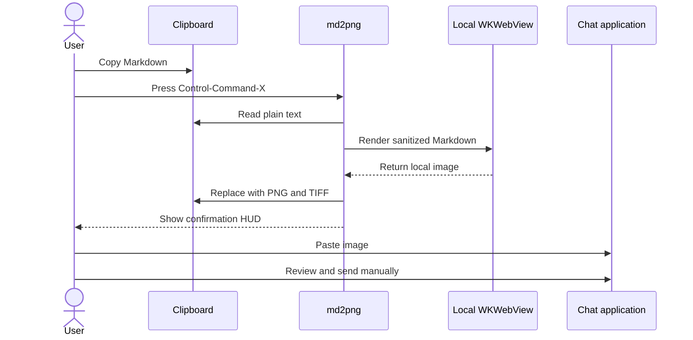

# Project Atlas — Weekly delivery report

**Reporting period:** August 10–14, 2026\
**Overall status:** 🟡 At risk\
**Prepared by:** Client Foundations

This is a deliberately long md2png sample. It exercises headings, paragraphs,
emphasis, lists, task lists, links, inline code, fenced code, wide tables, and
multiple Mermaid diagrams in one render.

## Executive summary

The team completed the local rendering pipeline and validated GitHub-style
tables and Mermaid diagrams on Apple silicon builds. The current
focus is release hardening: packaging, signing, installation testing, and
documentation for colleagues who do not have a development environment.

Two issues need attention. First, the authentication migration is waiting for a
security review. Second, one legacy client still depends on the previous API
contract. Neither issue blocks internal testing, but both must be resolved before
the public rollout milestone.

> **Decision requested:** approve the compatibility window through September 4
> so the client team can migrate without delaying the new release.

## Delivery dashboard

| Workstream | Owner | Status | Progress | Target | Risk | Next action |
|:--|:--|:--:|--:|:--:|:--:|:--|
| Native macOS companion | Alice | ✅ Done | 100% | Aug 12 | Low | Monitor feedback |
| Markdown renderer | Bob | ✅ Done | 100% | Aug 12 | Low | Add regression samples |
| Mermaid validation | Carol | ✅ Done | 100% | Aug 13 | Low | Test very tall diagrams |
| Apple silicon packaging | Diego | ✅ Done | 100% | Aug 13 | Low | Verify on a clean Mac |
| Developer ID signing | Erin | 🚧 In progress | 70% | Aug 18 | Medium | Request distribution certificate |
| Notarization | Erin | ⏳ Pending | 20% | Aug 19 | Medium | Store notary credentials |
| Security review | Frank | ⚠️ At risk | 45% | Aug 21 | High | Confirm threat-model owner |
| User documentation | Grace | 🚧 In progress | 80% | Aug 17 | Low | Add installation screenshots |
| Pilot rollout | Helen | ⏳ Pending | 10% | Aug 24 | Medium | Confirm ten pilot users |
| General availability | Team | ⏳ Pending | 5% | Sep 4 | Medium | Close release blockers |

## Highlights

- Rendered content stays entirely on the Mac.
- The basic workflow needs no Accessibility permission.
- Clipboard Markdown is preserved when rendering fails.
- External Markdown images are blocked to avoid unexpected network requests.
- The user reviews and sends the generated image manually.

### Completed this week

1. Renamed the product to **md2png**.
2. Added a low-saturation app icon and monochrome menu bar symbol.
3. Produced an Apple silicon `arm64` application bundle.
4. Added reproducible ZIP and DMG packaging.
5. Verified a real table-and-Mermaid render through `WKWebView`.

### Checklist for the pilot

- [x] App launches as a menu bar accessory.
- [x] `Control-Command-X` renders clipboard Markdown.
- [x] PNG and TIFF representations are written to the clipboard.
- [x] A GFM table renders with alignment.
- [x] A Mermaid flowchart renders locally.
- [ ] Test installation on a clean Mac.
- [ ] Test dark menu bar appearance.
- [ ] Complete Developer ID notarization.
- [ ] Collect feedback from ten pilot users.

## Release workflow



## Milestone timeline



## Request lifecycle



## Risk register

| ID | Risk | Probability | Impact | Mitigation | Owner |
|:--|:--|:--:|:--:|:--|:--|
| R-01 | Gatekeeper warns on non-notarized builds | High | High | Use Developer ID, notarize, and staple the app | Erin |
| R-02 | Extremely tall Markdown exceeds snapshot limits | Medium | Medium | Add height guidance and future image splitting | Bob |
| R-03 | Complex Mermaid source fails to parse | Medium | Low | Show the local error and preserve source Markdown | Carol |
| R-04 | External image URL leaks message context | Low | High | Replace external images with a blocked placeholder | Frank |
| R-05 | Users assume the app sends messages | Low | High | State manual paste and manual send throughout UI | Grace |
| R-06 | Global shortcut conflicts with another utility | Medium | Low | Document the shortcut and consider customization later | Alice |

## Compatibility notes

The current minimum is macOS 14. The app uses native AppKit, Carbon hot keys,
and WebKit. All JavaScript and CSS needed by the renderer are bundled in the
application, so the normal rendering path works offline after installation.

Inline formatting should remain readable: **strong emphasis**, *light
emphasis*, ~~completed work~~, `Control-Command-X`, and a normal link such as
[Apple WebKit](https://webkit.org/).

### Example configuration

```json
{
  "displayName": "md2png",
  "shortcut": "Control-Command-X",
  "rendering": "local-only",
  "output": ["public.png", "public.tiff"],
  "automaticSend": false,
  "networkUpload": false
}
```

### Example Swift guard

```swift
guard let markdown = NSPasteboard.general.string(forType: .string),
      !markdown.trimmingCharacters(in: .whitespacesAndNewlines).isEmpty else {
    throw AppError.emptyClipboard
}

renderer.render(markdown) { result in
    // Only a successful local render replaces the clipboard.
    // The application never sends a chat message automatically.
}
```

## Detailed validation matrix

| Scenario | Input characteristic | Expected output | Result |
|:--|:--|:--|:--:|
| Plain text | Several paragraphs | Readable wrapped text | ✅ Pass |
| Long heading | More than 60 characters | Wrap without clipping | ✅ Pass |
| GFM table | Seven columns and ten rows | Borders and alignment retained | ✅ Pass |
| Task list | Mixed checked states | Clear checklist glyphs | ✅ Pass |
| Code block | JSON and Swift | Monospace block with wrapping | ✅ Pass |
| Flowchart | Branching success and failure paths | Centered SVG diagram | ✅ Pass |
| Sequence diagram | Four participants | Ordered messages remain legible | ✅ Pass |
| Gantt chart | Multiple sections | Dates and bars remain visible | ✅ Pass |
| Failure path | Invalid Mermaid syntax | Error shown, source preserved | ✅ Pass |
| Manual paste | PNG in clipboard | Image attachment appears | ✅ Pass |

## Decisions and open questions

### Decisions

- Keep the MVP independent of chat-client internals and APIs.
- Keep the workflow explicit: copy, render, paste, review, send.
- Prefer a small native menu bar app over an Electron application.
- Use an image because tables and diagrams remain consistent across clients.

### Open questions

1. Should very tall output be split into several PNG files?
2. Should the global shortcut be configurable?
3. Is a compact dark theme valuable for code-heavy messages?
4. Should the last-render preview offer a Save As command?

## Final reminder

> md2png reads the clipboard only for preview or rendering, performs the render
> locally, and places the resulting image back on the clipboard. It does not
> upload Markdown, paste into another application, or send a message.

---

**End of sample.** If everything above appears in one crisp image without
cropped tables or diagrams, the long-content path is working as expected.
