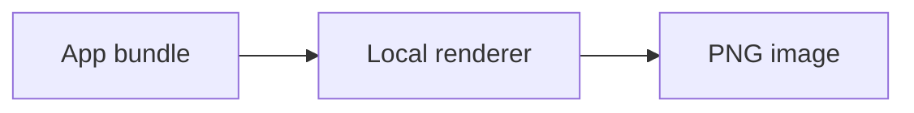

# Packaged renderer self-test

Markdown is **rendered locally** from resources inside the application bundle.

| Capability | Result |
|:--|:--:|
| GFM table | Ready |
| Highlighted code | Ready |
| Mermaid | Ready |

```swift
let output = "PNG"
```


