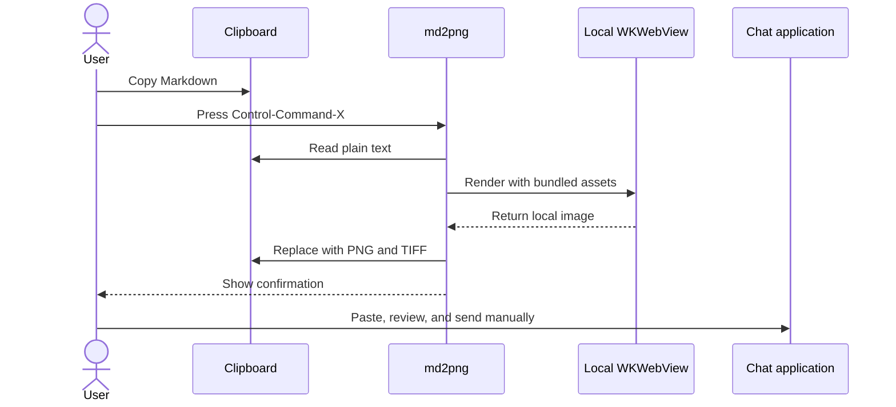

# Clipboard request lifecycle

```mermaid
sequenceDiagram
    actor User
    participant Clipboard
    participant App as md2png
    participant Renderer as Local WKWebView
    participant Chat as Chat application

    User->>Clipboard: Copy Markdown
    User->>App: Press Control-Command-X
    App->>Clipboard: Read plain text
    App->>Renderer: Render with bundled assets
    Renderer-->>App: Return local image
    App->>Clipboard: Replace with PNG and TIFF
    App-->>User: Show confirmation
    User->>Chat: Paste, review, and send manually
```
