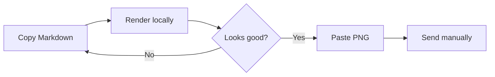

# Weekly delivery update

Everything below is rendered locally on your Mac.

| Area | Status | Owner | Notes |
|:--|:--:|--:|:--|
| macOS app | ✅ Done | Alice | Ready to share |
| Documentation | 🚧 In progress | Bob | Release notes next |
| Validation | ⏳ Pending | Carol | Test on a second Mac |

> md2png never sends a message automatically.
