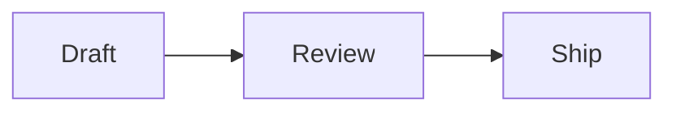

<p align="center">
  
</p>

<h1 align="center">md2png for Mac</h1>

<p align="center">
  Turn clipboard Markdown into a polished PNG—locally and privately.
</p>

<p align="center">
  <strong>English</strong> · <a href="README.zh-Hans.md">简体中文</a>
</p>

<p align="center">
  <a href="https://md2png.wbxsh.com/"><strong>Website</strong></a>
  ·
  <a href="#build-from-source"><strong>Build from source</strong></a>
  ·
  <a href="docs/PRIVACY.md">Privacy</a>
</p>

md2png is a small native macOS menu bar companion for chat apps that do not
fully render GitHub-style tables, syntax-highlighted code, or Mermaid diagrams.
It does not modify or inject code into another app, paste content, or send
messages.


## Requirements

- macOS 14 or newer
- Apple silicon (`arm64`); Intel Macs are not supported

## Use it

1. Copy Markdown in any app with `Command-C`.
2. Press `Control-Command-X` from anywhere, or choose **Render Clipboard as
   Image** from the menu bar.
3. Wait for the confirmation HUD.
4. Paste the generated PNG with `Command-V`.
5. Review the attachment and send it yourself.

The render command never activates another app, pastes into it, or sends a
message. If clipboard rendering fails, the source Markdown remains on the
clipboard.

## Supported content

| Content | Notes |
|---|---|
| Markdown | Headings, lists, links, quotes, emphasis, inline code, and fenced code |
| GFM-style content | Tables, strikethrough, and checklist source |
| Code blocks | Offline syntax highlighting for common languages including Swift, JavaScript, TypeScript, JSON, Shell, Python, Java, Kotlin, C/C++, Go, Rust, SQL, YAML, HTML/XML, and CSS |
| Mermaid | Flowcharts, sequence diagrams, Gantt charts, and other syntax supported by the bundled Mermaid version |

Mermaid must be inside a `mermaid` fence, and the first line inside the fence
must identify a Mermaid diagram type:

````markdown

````

For message-style arrows such as `A->>B: Hello`, use `sequenceDiagram` rather
than `flowchart`. See [Troubleshooting](docs/TROUBLESHOOTING.md) when a diagram
does not render.

A GFM table needs a separator row:

```markdown
| Platform | Status | Owner |
|:--|:--:|--:|
| macOS | Done | Alice |
| iOS | In progress | Bob |
```

## Menu bar commands

| Command | Shortcut | Behavior |
|---|---|---|
| Render Clipboard as Image | `Control-Command-X` (global) | Renders clipboard Markdown and replaces it with PNG/TIFF on success |
| Restore Last Markdown | — | Restores the latest successful source to the clipboard |
| Show Last Render | `Control-Command-Z` (global) | Opens the most recent result; close with `Command-W` |
| Examples | — | Copies and immediately renders the selected bundled sample |
| About md2png | — | Shows version, build and source commit, release notes, project link, update status/action, and copyable diagnostics |

The top of the menu contains a compact, read-only preview of the current
clipboard. While a render is running, additional render commands and examples
are temporarily disabled. Restore Last Markdown becomes available only after a
successful render and asks before replacing clipboard content changed by another
application.

## Samples

Choose an item under **Examples** to render it immediately:

- [Short weekly update](Examples/weekly-update.md)
- [Long project update](Examples/long-project-update.md)
- [Formatting](Examples/formatting.md)
- [Code blocks](Examples/code-blocks.md)
- [Checklist](Examples/checklist.md)
- [GFM table](Examples/table.md)
- [Flowchart](Examples/flowchart.md)
- [Sequence diagram](Examples/sequence-diagram.md)
- [Gantt timeline](Examples/gantt-timeline.md)

The [long rendered PNG](docs/images/long-project-update.png) is checked in as a
reference for tables, highlighted code, and multiple diagrams in one image.

## Privacy and security

- Rendering happens in a non-persistent local `WKWebView` using bundled assets.
- Markdown and generated images are never uploaded.
- The latest successful Markdown source is retained only in memory for the Last
  Markdown actions and is discarded when md2png quits.
- External Markdown images are replaced with a text placeholder instead of
  being fetched.
- No analytics, telemetry, advertising, account integration, bot, or
  service-specific API is included.
- Opening **About md2png** silently refreshes public GitHub Release metadata when
  the last successful result is more than 24 hours old. **Check Again** is
  available without exposing a GitHub account or credential; no Markdown or
  clipboard data is included in the request.
- The basic copy/render/paste workflow does not need Accessibility permission.
- The app never pastes or sends content automatically.

See [Privacy](docs/PRIVACY.md) and [Security](SECURITY.md) for details.

## Build from source

Requirements: macOS 14+, Apple silicon, Xcode 26+ with Swift 6.2, Node.js, and
pnpm.

```sh
make bootstrap
make test
make app CONFIGURATION=debug \
  PROJECT_URL=https://github.com/OWNER/REPOSITORY \
  BUNDLE_IDENTIFIER=io.github.OWNER.md2png
make verify-dist \
  PROJECT_URL=https://github.com/OWNER/REPOSITORY \
  BUNDLE_IDENTIFIER=io.github.OWNER.md2png
make run CONFIGURATION=debug \
  PROJECT_URL=https://github.com/OWNER/REPOSITORY \
  BUNDLE_IDENTIFIER=io.github.OWNER.md2png
```

To exercise a real update without editing the source version, override only the
packaged test app:

```sh
make run CONFIGURATION=debug \
  PROJECT_URL=https://github.com/guangyya/md2png \
  TEST_UPDATE_VERSION=0.0.0
```

`TEST_UPDATE_VERSION` is rejected by `publish-release`; public releases always
use `CFBundleShortVersionString` from `Info.plist`.

Debug builds can also mock the About update row without making a request:

```sh
make run CONFIGURATION=debug \
  PROJECT_URL=https://github.com/guangyya/md2png \
  TEST_UPDATE_VERSION=0.0.0 \
  TEST_UPDATE_STATE=up-to-date       # or check-failed / download-failed / ready-to-install
```

`TEST_UPDATE_STATE` is accepted only for local Debug app/run builds and is
rejected by the release publisher. Download-related mocks use the immutable
published v0.1.0 DMG metadata so retries run through real verification. If that
cached DMG has been removed, `ready-to-install` starts at the recoverable
download failure instead of exposing an invalid Open action.

`make app` creates `dist/md2png.app`. Local builds are ad-hoc signed unless a
signing identity is supplied. `PROJECT_URL` is optional; when omitted, About
hides the project and update controls. The source contains
no repository URL. `BUNDLE_IDENTIFIER` defaults to the personal identifier in
`Info.plist` and can be overridden without editing source files.
`make verify-dist` rebuilds the app, verifies its signature and arm64
architecture, then renders a bundled Markdown, GFM table, highlighted Swift
snippet, and Mermaid diagram without reading or modifying the clipboard.

## Release artifacts

```sh
make release
make dmg
```

These produce ad-hoc Apple silicon artifacts for local testing. Public releases
use a guarded Developer ID, notarization, stapling, tag, and upload workflow:

```sh
make publish-release \
  GH_REPO=OWNER/REPOSITORY \
  BUNDLE_IDENTIFIER=io.github.OWNER.md2png \
  SIGN_IDENTITY="Developer ID Application: Your Name (TEAMID)" \
  NOTARY_PROFILE=MDPNGNotary
```

Each published release contains a versioned ZIP, a versioned DMG, and the fixed
`md2png-latest.dmg` alias. See [Releasing](docs/RELEASING.md) before running
the command.

## Project layout

```text
Sources/MD2PNG/              Native Swift/AppKit application
Sources/MD2PNG/Resources/    Localized strings and bundled renderer output
WebRenderer/                Markdown, sanitization, highlighting, and Mermaid source
Examples/                   Markdown samples bundled with the app
Tests/                      Swift and end-to-end rendering tests
Assets/AppIcon/             Approved app icon source
docs/                       Product, privacy, troubleshooting, and release documentation
BACKLOG.md                  Prioritized candidate, deferred, and excluded product work
TECH_DEBT.md                Internal architecture work and migration ordering
.github/ISSUE_TEMPLATE/     Structured GitHub feature request entry point
```

## Contributing and license

Focused bug reports and improvements are welcome. Use the
[Feature request template](../../issues/new?template=feature_request.yml)
for new ideas. Accepted and candidate directions are tracked in the
[Product backlog](BACKLOG.md); inclusion does not promise a version or date.
Read [Contributing](CONTRIBUTING.md) before opening a pull request and use the
[Security policy](SECURITY.md) for vulnerabilities.

md2png is available under the [MIT License](LICENSE). Bundled dependencies keep
their own licenses; see [Third-party notices](THIRD_PARTY_NOTICES.md).
