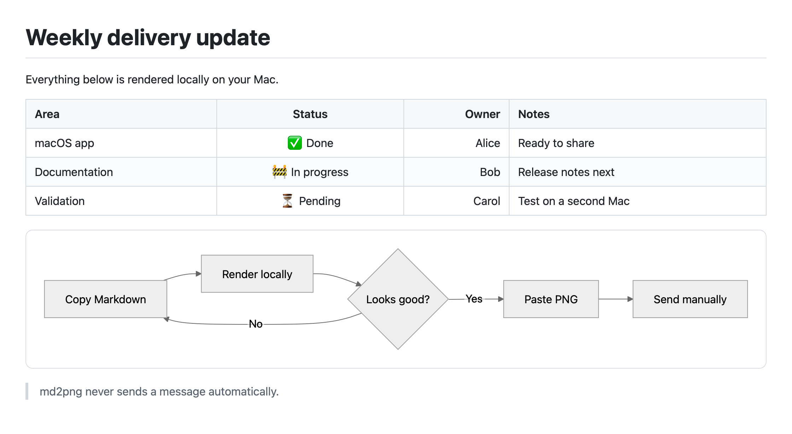
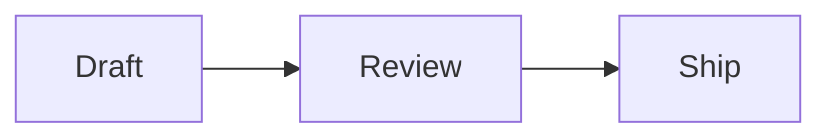

<p align="center">
  
</p>

<h1 align="center">md2png for Mac</h1>

<p align="center">
  Turn clipboard Markdown into a polished PNG—locally and privately.
</p>

<p align="center">
  <strong>English</strong> · <a href="README.zh-Hans.md">简体中文</a>
</p>

<p align="center">
  <a href="https://md2png.wbxsh.com/"><strong>Website</strong></a>
  ·
  <a href="#build-from-source"><strong>Build from source</strong></a>
  ·
  <a href="docs/PRIVACY.md">Privacy</a>
</p>

md2png is a small native macOS menu bar companion for chat apps that do not
fully render GitHub-style tables, syntax-highlighted code, or Mermaid diagrams.
It does not modify or inject code into another app, paste content, or send
messages.



## Requirements

- macOS 14 or newer
- Apple silicon (`arm64`); Intel Macs are not supported

## Use it

1. Copy Markdown in any app with `Command-C`.
2. Press `Control-Command-X` from anywhere, or choose **Render Clipboard as
   Image** from the menu bar.
3. Wait for the confirmation HUD.
4. Paste the generated PNG with `Command-V`.
5. Review the attachment and send it yourself.

The render command never activates another app, pastes into it, or sends a
message. If clipboard rendering fails, the source Markdown remains on the
clipboard.

For a very tall result, choose **Save Clipboard as Split PNGs…** instead. Pick a
parent folder and md2png creates a new, safely named folder of numbered PNGs.
This explicit export reads the current clipboard but never replaces it.

## Supported content

| Content | Notes |
|---|---|
| Markdown | Headings, lists, links, quotes, emphasis, inline code, and fenced code |
| GFM-style content | Tables, strikethrough, and checklist source |
| Code blocks | Offline syntax highlighting for common languages including Swift, JavaScript, TypeScript, JSON, Shell, Python, Java, Kotlin, C/C++, Go, Rust, SQL, YAML, HTML/XML, and CSS |
| Mermaid | Flowcharts, sequence diagrams, Gantt charts, and other syntax supported by the bundled Mermaid version |

Mermaid must be inside a `mermaid` fence, and the first line inside the fence
must identify a Mermaid diagram type:

````markdown

````

For message-style arrows such as `A->>B: Hello`, use `sequenceDiagram` rather
than `flowchart`. See [Troubleshooting](docs/TROUBLESHOOTING.md) when a diagram
does not render.

A GFM table needs a separator row:

```markdown
| Platform | Status | Owner |
|:--|:--:|--:|
| macOS | Done | Alice |
| iOS | In progress | Bob |
```

## Menu bar commands

| Command | Shortcut | Behavior |
|---|---|---|
| Render Clipboard as Image | `Control-Command-X` by default (global) | Renders clipboard Markdown and replaces it with PNG/TIFF on success |
| Save Clipboard as Split PNGs… | — | Creates a new folder of numbered PNGs from clipboard Markdown without changing the clipboard |
| Show Last Render | `Control-Command-Z` by default (global) | Opens the most recent result with copy, save, open, fit, actual-size, and zoom controls |
| Re-render Last Markdown | — | Renders the latest successful source with the currently selected theme and width |
| Restore Last Markdown | — | Restores the latest successful source to the clipboard |
| Theme | — | Selects Clean Light, Warm Paper, or Dark for subsequent renders and remembers the selection locally |
| Output Width | — | Selects Compact, Standard, or Wide for subsequent renders and remembers the selection locally |
| Examples | — | Copies and renders the selected bundled sample, then opens its preview |
| Launch at Login | — | Opts the main app into the native macOS login service; off by default |
| Settings… | `Command-,` | Records, applies, and restores the two global shortcuts |
| Show Welcome | — | Reopens the copy, render, and paste guide with current shortcut status |
| About md2png | — | Shows release and update information, runs the bundled renderer self-test, and saves privacy-safe diagnostic logs |

The top of the menu contains a compact, read-only preview of the current
clipboard. Standard preserves the original output sizing; Compact wraps prose
sooner, while Wide gives large tables and diagrams more room. Clean Light is the
default theme; Warm Paper and Dark apply coordinated Markdown, code-highlighting,
and Mermaid colors without changing typography, spacing, or output width. The
chosen theme is fixed into an opaque PNG. While a render is running, additional
render commands, width or theme changes, and examples are temporarily disabled.
Re-render Last Markdown and Restore Last Markdown become available only after a
successful render and ask before replacing clipboard content changed by another
application.

Split export uses the selected Theme and Output Width and limits each logical
slice to 4,000 points. It prefers boundaries between blocks and list items,
keeps headings with following content, and avoids cutting a code block, Mermaid
diagram, or table row when that element fits within one slice. An element taller
than a full slice is cut at the hard limit so export can still finish. Files are
written into one newly created folder with stable zero-padded numbering; an
existing folder is never overwritten.

Choose **Settings…** to change either global shortcut. A shortcut must include
Control, Option, or Command, and the two commands cannot use the same
combination. Changes apply immediately and stay local. If macOS cannot register
a combination, Settings marks it unavailable while the equivalent menu command
continues to work; **Restore Defaults** returns to `Control-Command-X` and
`Control-Command-Z`.

The Last Render window opens at a width that reflects the output, within the
current screen, and identifies the preset and PNG pixel dimensions in its
title. Its toolbar can copy the image again, save it explicitly, open it in
Preview, fit it to the window, inspect one PNG pixel per display backing pixel,
and zoom without changing the generated image or clipboard contents.

When rendering fails, md2png shows a compact details dialog that distinguishes
Mermaid syntax, bundled-resource, WebKit recovery, timeout, size-limit, invalid
response, and PNG-generation failures. Mermaid failures identify the diagram
number and a nearby Markdown line when available. **Copy Error Details** copies
only safe troubleshooting metadata; it never includes the Markdown or raw
WebKit/Mermaid error text.
The welcome guide opens once on first launch and can be reopened from the menu.
It scrolls within smaller displays and at larger accessibility text sizes, and
includes an optional, state-aware Launch at Login control. Its sample button
opens a status-item menu guide that first shows the main menu, then reveals
Examples; rendering starts only after the user chooses a sample. While the guide
is open, md2png appears in Command-Tab so the window cannot become unreachable;
closing the guide returns the app to its menu bar-only mode.
Launch at Login always reflects the effective macOS state with an explicit
action. If approval is required, the single menu row becomes **Allow Launch at
Login…**, shows a trailing alert badge, and opens Login Items settings when
selected. Disabling it unregisters the login item; no helper or background
worker is installed.
See the [width preset feature notes](docs/PRODUCT.md#width-presets) for exact
dimensions and same-source reference renders, and the
[theme notes](docs/PRODUCT.md#render-themes) for the bundled palette boundaries.

## Examples

Choose an item under **Examples** to render it immediately:

- [Short weekly update](Examples/weekly-update.md)
- [Long project update](Examples/long-project-update.md)
- [Formatting](Examples/formatting.md)
- [Code blocks](Examples/code-blocks.md)
- [Checklist](Examples/checklist.md)
- [GFM table](Examples/table.md)
- [Flowchart](Examples/flowchart.md)
- [Sequence diagram](Examples/sequence-diagram.md)
- [Gantt timeline](Examples/gantt-timeline.md)

The [long rendered PNG](docs/images/long-project-update.png) is checked in as a
reference for tables, highlighted code, and multiple diagrams in one image.

## Privacy and security

- Rendering happens in a non-persistent local `WKWebView` using bundled assets.
- Markdown and generated images are never uploaded.
- Split PNG export is user-initiated, Save-only, and never writes images to the
  clipboard.
- The latest successful Markdown source is retained only in memory for the Last
  Markdown actions and is discarded when md2png quits.
- External Markdown images are replaced with a text placeholder instead of
  being fetched.
- No analytics, telemetry, advertising, account integration, bot, or
  service-specific API is included.
- A bounded local diagnostic log records only allowlisted operational metadata;
  it never stores Markdown, clipboard payloads, rendered images, or full paths,
  and it is never uploaded automatically.
- Opening **About md2png** does not make an update request. Choosing **Check for
  Updates…** fetches the signed public appcast without a GitHub account or
  credential; no Markdown, clipboard data, or system profile is included.
- The basic copy/render/paste workflow does not need Accessibility permission.
- The app never pastes or sends content automatically.

See [Privacy](docs/PRIVACY.md) and [Security](SECURITY.md) for details.

## Build from source

Requirements: macOS 14+, Apple silicon, Xcode 26+ with Swift 6.2, Node.js, and
pnpm.

```sh
make bootstrap
make test
make app CONFIGURATION=debug \
  PROJECT_URL=https://github.com/OWNER/REPOSITORY \
  BUNDLE_IDENTIFIER=io.github.OWNER.md2png
make verify-dist \
  PROJECT_URL=https://github.com/OWNER/REPOSITORY \
  UPDATE_CHANNEL=stable \
  BUNDLE_IDENTIFIER=io.github.OWNER.md2png
make run CONFIGURATION=debug \
  PROJECT_URL=https://github.com/OWNER/REPOSITORY \
  BUNDLE_IDENTIFIER=io.github.OWNER.md2png
```

Debug builds never use the stable production update channel, even when a
`PROJECT_URL` is packaged. Use the explicit local fixture to exercise the About
update row without making a release-metadata request:

```sh
make run CONFIGURATION=debug \
  PROJECT_URL=https://github.com/guangyya/md2png \
  TEST_UPDATE_VERSION=0.0.0 \
  TEST_UPDATE_STATE=up-to-date       # or check-failed / download-failed / ready-to-install
```

`TEST_UPDATE_STATE` is accepted only for local Debug app/run builds and is
rejected by the release publisher. `TEST_UPDATE_VERSION` changes only the
packaged test app version and is also rejected by `publish-release`; public
releases always use `CFBundleShortVersionString` from `Info.plist`.
Download-related mocks use non-routable fixture metadata and cannot start an
update or artifact request while the Debug update channel is disabled. If the
fixture file is absent, `ready-to-install` starts at a recoverable display-only
download failure instead of exposing an invalid Open action.

`make app` creates the default Release bundle at `dist/md2png.app`.
`make app CONFIGURATION=debug` and `make run CONFIGURATION=debug` use the
separate Debug bundle at `dist/debug/md2png.app`. Local builds are ad-hoc signed
unless a signing identity is supplied. `PROJECT_URL` is optional; when omitted,
About hides the project and update controls. Debug builds keep a configured
project link but hide production update controls. Only a build explicitly
packaged with `UPDATE_CHANNEL=stable` and a valid GitHub project URL uses the
stable GitHub Releases channel; missing, unknown, and future channel values stay
disabled. The source contains no repository URL. `BUNDLE_IDENTIFIER` defaults
to the personal identifier in `Info.plist` and can be overridden without
editing source files.
`make verify-dist` rebuilds the app, verifies its signature and arm64
architecture, then renders a bundled Markdown, GFM table, highlighted Swift
snippet, and Mermaid diagram without reading or modifying the clipboard.

## Release artifacts

```sh
make release
make dmg
```

These produce ad-hoc Apple silicon artifacts for local testing. Public releases
use a guarded Developer ID, notarization, stapling, tag, and upload workflow:

```sh
make publish-release \
  GH_REPO=OWNER/REPOSITORY \
  BUNDLE_IDENTIFIER=io.github.OWNER.md2png \
  SIGN_IDENTITY="Developer ID Application: Your Name (TEAMID)" \
  NOTARY_PROFILE=MDPNGNotary
```

Each published release contains a signed Sparkle appcast, a versioned ZIP, a
versioned DMG, the fixed `md2png-latest.dmg` alias, and two coverage reports.
See [Releasing](docs/RELEASING.md) before running the command.

## Project layout

```text
Sources/MD2PNG/{Application,About,Preview,Rendering,Updates,Welcome}/
                            Feature-first native Swift/AppKit sources
Sources/MD2PNG/Resources/   Localized strings and bundled renderer output
Tests/MD2PNGTests/          Mirrored feature tests and test support
WebRenderer/                Markdown, sanitization, highlighting, and Mermaid source
Examples/                   Markdown samples bundled with the app
Assets/AppIcon/             Approved app icon source
docs/                       Product, privacy, troubleshooting, and release documentation
.github/ISSUE_TEMPLATE/     Structured GitHub feature request entry point
```

## Contributing and license

Focused bug reports and improvements are welcome. Use the
[Feature request template](../../issues/new?template=feature_request.yml)
for new ideas. Accepted and candidate directions are tracked in the
[public GitHub Issues](https://github.com/guangyya/md2png/issues); issues labeled
`backlog` do not promise a version or date.
Read [Contributing](CONTRIBUTING.md) before opening a pull request and use the
[Security policy](SECURITY.md) for vulnerabilities.

md2png is available under the [MIT License](LICENSE). Bundled dependencies keep
their own licenses; see [Third-party notices](THIRD_PARTY_NOTICES.md).
