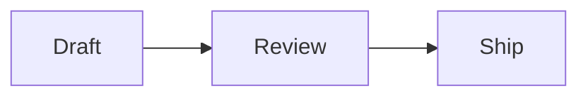

<p align="center">
  
</p>

<h1 align="center">md2png for Mac</h1>

<p align="center">
  在 Mac 上将剪贴板中的 Markdown 转为精美 PNG——全程本地，保护隐私。
</p>

<p align="center">
  <a href="README.md">English</a> · <strong>简体中文</strong>
</p>

<p align="center">
  <a href="https://md2png.wbxsh.com/zh/"><strong>官方网站</strong></a>
  ·
  <a href="#从源码构建"><strong>从源码构建</strong></a>
  ·
  <a href="docs/PRIVACY.md">隐私说明</a>
</p>

md2png 是一个原生 macOS 菜单栏小工具，适合在无法完整显示 GFM 表格、
代码高亮或 Mermaid 图表的聊天应用中使用。它不修改或注入其它应用，
不会自动粘贴，也不会自动发送消息。


## 系统要求

- macOS 14 或更高版本
- Apple 芯片（`arm64`）；不支持 Intel Mac

## 使用方式

1. 在任意应用中用 `Command-C` 复制 Markdown。
2. 在任意应用中按 `Control-Command-X`，或从菜单栏选择“将剪贴板渲染为图片”。
3. 等待底部 HUD 提示成功。
4. 按 `Command-V` 粘贴 PNG。
5. 检查附件后由你自己发送。

也可以在 Finder 中右键点按 `.md` 或 `.markdown` 文件，选择“打开方式 → md2png”；
md2png 会在本机渲染，并在成功后打开自己的“预览”窗口。Finder 中的
“服务 → Preview with md2png”也会执行相同操作。两者都不会改变剪贴板；
只有在“预览”中明确选择“复制”后，PNG 才会进入剪贴板。

渲染命令不会激活其它应用、不会自动粘贴，也不会发送。如果渲染失败，
剪贴板中的源 Markdown 会保留。

内置示例会直接在“预览”中打开，不会改变剪贴板。需要将 PNG 放到剪贴板时，
再使用“预览”中的“复制”操作。

如果结果超过单图高度限制，错误对话框会提供“分片保存为 PNG…”。分片渲染完成后，
文件夹选择器会显示准确的 PNG 数量。选择一个上级文件夹后，md2png 会新建文件夹并
保存带编号的 PNG；这个显式导出使用失败渲染中保留的源 Markdown，不会替换剪贴板。
保存完成后可选择“在 Finder 中显示”，一次选中全部导出图片并拖到其他应用。

## 支持的内容

| 类型 | 说明 |
|---|---|
| Markdown | 标题、列表、链接、引用、强调、行内代码和代码块 |
| GFM 风格 | 表格、删除线和 checklist 源文本 |
| 代码块 | Swift、JavaScript、TypeScript、JSON、Shell、Python、Java、Kotlin、C/C++、Go、Rust、SQL、YAML、HTML/XML 和 CSS 等离线高亮 |
| Mermaid | 流程图、时序图、Gantt 图以及内置 Mermaid 版本支持的其它语法 |

Mermaid 必须使用 `mermaid` 代码 fence，且 fence 内第一行要声明图表类型：

````markdown

````

`A->>B: Hello` 这类消息箭头属于 `sequenceDiagram`，不是 `flowchart`。渲染失败时
可查看 [故障排查](docs/TROUBLESHOOTING.md)。

## 菜单栏命令

| 命令 | 快捷键 | 行为 |
|---|---|---|
| 将剪贴板渲染为图片 | `Control-Command-X`（全局） | 成功后用 PNG/TIFF 替换剪贴板 |
| 渲染 Markdown 文件… | — | 读取明确选择的 UTF-8 `.md`、`.markdown` 或 `.txt` 文件，禁用其它扩展名，仅在成功后将 PNG/TIFF 写入剪贴板 |
| 显示上次渲染 | `Control-Command-Z`（全局） | 在预览窗口中打开最近结果，并提供拖动、复制、保存、在“预览”中打开、适合窗口、实际大小和缩放操作 |
| 重新渲染上次的 Markdown | — | 使用当前主题和宽度重新渲染最近一次成功的源 Markdown |
| 恢复上次的 Markdown | — | 将最近一次成功的源 Markdown 恢复到剪贴板 |
| 主题 | — | 在简洁浅色、暖色纸张、深色、高对比度和午夜蓝之间选择，并在本地记住选择 |
| 输出宽度 | — | 为后续渲染选择紧凑、标准或宽幅，并在本地记住选择 |
| 示例 | — | 渲染选中的内置示例并打开预览，不改变剪贴板 |
| 登录时启动 | — | 将主 App 注册到原生 macOS 登录项；默认关闭 |
| 设置… | `Command-,` | 录制、应用和恢复两个全局快捷键 |
| 显示欢迎指南 | — | 重新打开复制、渲染和粘贴指南，并显示当前快捷键状态 |
| 关于 md2png | — | 显示发布与更新信息、运行内置渲染器自测，并保存不含内容的诊断日志 |

菜单顶部会显示紧凑的剪贴板预览。“标准”保持原有输出尺寸，“紧凑”会更早换行，
“宽幅”则为大型表格和图表留出更多空间。“简洁浅色”是默认主题；“暖色纸张”、
“深色”、“高对比度”和“午夜蓝”会统一切换 Markdown、代码高亮和 Mermaid 配色，
但不会改变字体、间距或输出宽度。所选主题会固定写入不透明的 PNG。正在渲染时，
新的渲染命令、宽度或主题切换和示例会暂时禁用，避免重复渲染。只有成功渲染后才会
启用“重新渲染上次的 Markdown”和“恢复上次的 Markdown”；如果其他应用已经修改
剪贴板，覆盖前会要求确认。
分片导出会使用当前主题和输出宽度，每片逻辑高度最多 4,000 点。它优先在块和列表项之间
切分，让标题跟随后续内容，并在代码块、Mermaid 图或表格行能放进单片时避免从中间切开；
如果某个元素本身超过单片上限，则会按硬上限切分以完成导出。文件会放入一个新建文件夹，
采用固定补零编号，绝不覆盖已有文件夹。
选择“设置…”可以修改两个全局快捷键。每个快捷键必须包含 Control、Option 或 Command，
且两个命令不能使用同一组合。修改会立即生效并只保存在本机；如果 macOS 无法注册某个
组合，“设置”会将其标记为不可用，而对应菜单命令仍可使用。“恢复默认值”会还原为
`Control-Command-X` 和 `Control-Command-Z`。
通过“显示上次渲染”打开的“预览”窗口会在当前屏幕范围内按输出宽度打开，并在
标题中标明所用预设和 PNG 像素尺寸。可以把渲染图片拖到 Finder 或其他兼容应用，
在所选目标中创建 PNG。工具栏可以再次复制图片、明确保存、在 Apple“预览”中
打开、适合窗口、按显示器像素查看实际大小，以及缩放预览；这些操作不会改变生成的
图片或剪贴板内容。
欢迎指南只会在首次启动时自动打开，之后可从菜单重新查看。它会在较小屏幕和较大的
辅助功能字号下滚动适配，并包含一个可选且会反映实际状态的“登录时启动”设置。
示例按钮会在菜单栏图标下先展示主菜单，再展开“示例”；只有用户再次选择一个示例后
才会开始渲染。指南打开期间，md2png 会出现在 Command-Tab 中，关闭指南后会恢复为
纯菜单栏模式。
“登录时启动”会通过明确操作反映 macOS 中的实际状态。需要用户批准时，单个菜单项会变为
“允许登录时启动…”，在右侧显示提醒标记，点击后打开“登录项”设置；关闭选项会注销登录项，
不会安装 Helper 或后台进程。
实际尺寸和同源渲染对比见[宽度预设功能说明](docs/PRODUCT.md#width-presets)，
内置配色边界见[渲染主题说明](docs/PRODUCT.md#render-themes)。

## 示例

菜单中包含短示例、长示例、排版、代码块、Checklist、GFM 表格、流程图、时序图和
Gantt 时间线。源文件位于 [Examples](Examples)，完整效果可查看
[long-project-update.png](docs/images/long-project-update.png)。

## 隐私

- 使用内置资源在非持久化本地 `WKWebView` 中渲染。
- Markdown 和生成的图片永远不会上传。
- “渲染 Markdown 文件…”只读取本次明确选择的文件，不保留最近文件或历史；取消选择、
  读取失败或渲染失败时都不会改变剪贴板。
- Finder 的“打开方式 → md2png”一次只接收一个 `.md` 或 `.markdown` 文件，复用当前
  渲染设置，并只在成功后打开“预览”，不会改变剪贴板。
- “服务 → Preview with md2png”一次只接收一个 Finder 文件，并执行相同的类型检查和
  失败保护。macOS 服务无法按扩展名隐藏该命令，因此不支持的文件会在调用后被拒绝，
  支持的文件也会保持剪贴板不变，直到用户在“预览”中明确选择“复制”。
- 分片 PNG 只会在单图超限后作为明确的恢复操作提供，并仅保存到用户选择的位置，
  不会把图片写入剪贴板。
- 拖动开始后才会在系统临时目录中为当前预览创建一份隔离的 PNG。未曾成功放置的取消
  拖动会立即清理；成功放置后，文件会保留供接收应用读取，并在 md2png 退出时删除。
  拖动不会改变剪贴板。
- 最近一次成功渲染的源 Markdown 仅保存在内存中，退出 md2png 后立即丢弃。
- 外部 Markdown 图片会被替换为文本占位符，不会发起网络请求。
- 不包含分析、遥测、广告、账号集成、Bot 或特定服务 API。
- 打开“关于 md2png”不会发起更新请求。只有明确选择“检查更新…”才会获取公开的
  签名 appcast；请求中不包含 Markdown、剪贴板数据、系统概况或 GitHub 凭据。
- 基础的复制/渲染/粘贴流程不需要 Accessibility 权限。
- 绝不自动粘贴或发送。

详情见 [隐私说明](docs/PRIVACY.md) 和 [安全策略](SECURITY.md)。

## 从源码构建

需要 macOS 14+、Apple 芯片、Xcode 26+ / Swift 6.2、Node.js 和 pnpm。

```sh
make bootstrap
make test
make app CONFIGURATION=debug \
  PROJECT_URL=https://github.com/OWNER/REPOSITORY \
  BUNDLE_IDENTIFIER=io.github.OWNER.md2png
make verify-dist \
  PROJECT_URL=https://github.com/OWNER/REPOSITORY \
  UPDATE_CHANNEL=stable \
  BUNDLE_IDENTIFIER=io.github.OWNER.md2png
make run CONFIGURATION=debug \
  PROJECT_URL=https://github.com/OWNER/REPOSITORY \
  BUNDLE_IDENTIFIER=io.github.OWNER.md2png
```

即使打包了 `PROJECT_URL`，Debug 构建也绝不会使用稳定生产更新渠道。需要测试
About 更新状态时，请使用显式的本地 fixture；它不会发送 Release 元数据请求：

```sh
make run CONFIGURATION=debug \
  PROJECT_URL=https://github.com/guangyya/md2png \
  TEST_UPDATE_VERSION=0.0.0 \
  TEST_UPDATE_STATE=up-to-date       # 也可使用 check-failed / download-failed / ready-to-install
```

`TEST_UPDATE_STATE` 仅允许用于本地 Debug app/run 构建，发布流程会拒绝它。
`TEST_UPDATE_VERSION` 只修改打包后的测试 App 版本，`publish-release` 同样会拒绝它；
公开发布始终使用 `Info.plist` 中的 `CFBundleShortVersionString`。下载相关 mock
使用不可路由的 fixture 元数据；Debug 更新渠道禁用时，它无法发起更新或资产请求。
如果 fixture 文件不存在，`ready-to-install` 会先显示仅供界面测试的可恢复下载失败
状态，而不会提供一个指向缺失文件的“打开”操作。

`PROJECT_URL` 只在打包时写入 App；省略时 About 会隐藏项目与更新控件。Debug
构建会保留已配置的项目链接，但隐藏生产更新控件。只有显式打包了
`UPDATE_CHANNEL=stable` 且带有效 GitHub 项目地址的构建才使用稳定 GitHub Releases
渠道；缺失、未知和未来新增的渠道值默认禁用。源码不包含固定仓库地址。
`BUNDLE_IDENTIFIER` 默认读取 `Info.plist` 中的个人标识，也可在构建时覆盖。
`make verify-dist` 会重新构建 App，检查签名和 arm64 架构，再通过内置
Markdown、GFM 表格、高亮 Swift 代码和 Mermaid 图执行离线渲染自测；
该过程不会读取或修改剪贴板。

发布、Developer ID 签名和 Apple 公证流程见 [Releasing](docs/RELEASING.md)。

## 贡献与许可证

欢迎聚焦的 Bug 报告和改进。新功能请使用
[Feature Request 模板](../../issues/new?template=feature_request.yml)，
已筛选的方向记录在
[公开 GitHub Issues](https://github.com/guangyya/md2png/issues)；带 `backlog`
标签不代表承诺版本或时间。
提交 PR 前请阅读 [Contributing](CONTRIBUTING.md)；安全问题请按
[Security policy](SECURITY.md) 处理。

md2png 使用 [MIT License](LICENSE)；内置依赖保留各自许可证，见
[Third-party notices](THIRD_PARTY_NOTICES.md)。
