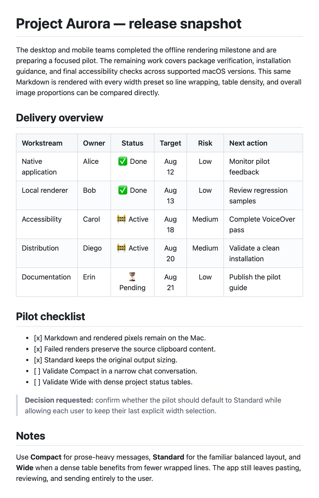
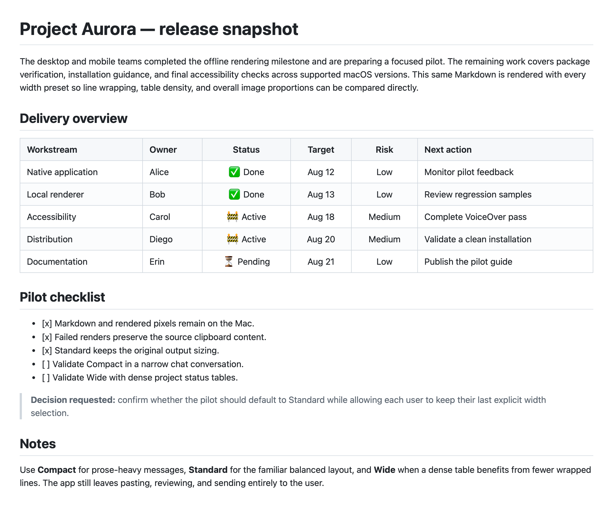
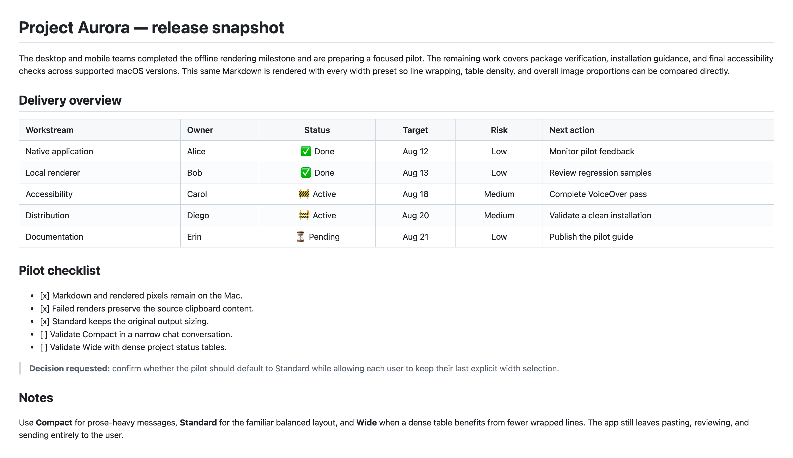

# Product brief

md2png is a local-first macOS menu bar companion that converts clipboard
Markdown into a paste-ready PNG without uploading, pasting, or sending content.

## Problem

Many chat clients support only part of Markdown. GFM-style tables, highlighted
code, and Mermaid diagrams may appear as unformatted source. Using a separate
editor, taking a screenshot, cropping it, and returning to the chat is too slow
for everyday project updates.

## Product decision

Use a standalone native companion rather than modifying or injecting code into
another application:

```text
Copy Markdown -> Control-Command-X -> local render -> PNG clipboard -> paste -> review -> send
```

The image keeps table and diagram layout consistent across desktop and mobile
clients. The sender always reviews the attachment and remains responsible for
sending it.

## Product principles

- **Explicit:** copy, render, paste, review, and send remain separate user
  actions.
- **Local:** message content and rendered pixels stay on the Mac.
- **Permission-friendly:** the basic workflow does not need Accessibility
  permission.
- **Independent:** no destination-app login, API, bot, extension, or internal
  integration.
- **Small and native:** Swift, AppKit, Carbon hot keys, WebKit, and bundled web
  renderer assets instead of Electron.

## Current scope

- Apple silicon Macs running macOS 14 or newer.
- Standard Markdown, GFM-style tables, checklist source, strikethrough, and
  syntax-highlighted fenced code.
- Mermaid fences including flowcharts, sequence diagrams, and Gantt charts.
- Retina-friendly PNG/TIFF clipboard output.
- Global render and last-preview shortcuts plus equivalent menu commands.
- A one-time first-launch guide with the three-step workflow, live shortcut
  registration status, an explicit menu-guided short-sample action, and a menu
  command to reopen it. Bundled examples open their preview after rendering.
- Compact clipboard preview, non-activating HUD, and an in-memory preview of the
  latest successful render with explicit copy, save, Preview, fit, actual-size,
  and zoom controls.
- In-memory access to re-render or restore the latest successful Markdown,
  guarded by clipboard ownership checks and explicit replacement confirmation.
- Short, long, formatting, code, checklist, table, flowchart, sequence, and
  Gantt samples that render immediately when selected.
- English and Simplified Chinese UI selected from macOS language settings.
- About window with Debug/Release identification, version/build/source commit,
  release notes, project link, update action, and copyable diagnostics.
- Silent update discovery in About, backed by a 24-hour successful-result cache
  and a rate-limited **Check Again** action. A newer signed DMG downloads only
  after **Download Update** is clicked, is verified, and opens for the user to
  finish installation. Progress stays in the About row and status item, with
  milestone-only VoiceOver announcements rather than a modal progress window.
- Duplicate render entry points disabled while one render is in progress.
- Compact, Standard, and Wide output-width presets, with the last explicit
  selection remembered locally and Standard preserving the original sizing.

## Width presets

Compact wraps prose sooner, Standard preserves the original output sizing, and
Wide gives dense tables and diagrams more room. The Last Render window reflects
the selected output width within the current screen and identifies the preset
and PNG pixel dimensions in its title. Actual Size maps one PNG pixel to one
display backing pixel, while zoom changes only the preview presentation.

These are real Retina outputs from the same
[width comparison source](../Examples/width-presets.md). They live here instead
of the README so the repository front page does not download the full-size
reference images. Click a preview to inspect its PNG.

| Compact | Standard | Wide |
|:--:|:--:|:--:|
| 720 × 1,120 pt<br>1,440 × 2,240 px | 1,120 × 928 pt<br>2,240 × 1,856 px | 1,520 × 880 pt<br>3,040 × 1,760 px |
| [](images/width-preset-compact.png) | [](images/width-preset-standard.png) | [](images/width-preset-wide.png) |

## Safety and privacy constraints

- Never send, paste, or upload message content automatically.
- Preserve clipboard Markdown when a clipboard render fails.
- Disable raw Markdown HTML and sanitize generated HTML.
- Block external Markdown images so rendering cannot fetch a message-derived URL.
- Bundle all JavaScript, CSS, localization, and examples required at runtime.
- Keep the last render in memory only; do not create a content history.
- Keep only its paired latest source Markdown in memory and discard it on quit.

## Deliberate non-goals

- Editing Markdown inside the app.
- Monitoring or intercepting another application's messages.
- Launch-time or scheduled update checks, silent app replacement, or an embedded
  GitHub credential.
- Cloud rendering, shared storage, analytics, or telemetry.
- Intel (`x86_64`) distribution.

## Backlog

Candidate features, technical debt, and deliberately deferred ideas are
maintained as [public GitHub Issues](https://github.com/guangyya/md2png/issues).
Each issue labeled `backlog` is the source for its scope, constraints, and
validation. Backlog placement confirms product fit, not a release date or
implementation commitment.
