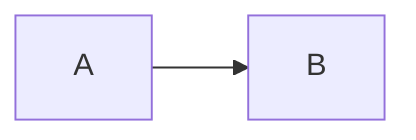
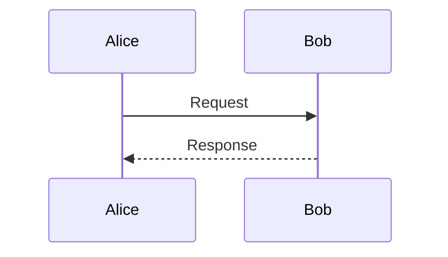

# Troubleshooting

## The app launches but no window appears

md2png is a menu bar accessory. It does not show a Dock icon or open a main
window at launch. Look for the md2png symbol in the macOS menu bar. If the menu
bar is crowded, check hidden menu bar items or temporarily quit another utility.

## A global shortcut does nothing

The default shortcuts are:

- Render: `Control-Command-X`
- Show Last Render: `Control-Command-Z`

Another utility can reserve the same system-wide combination. md2png shows a
local warning when registration fails; the equivalent menu bar commands remain
available. The app does not require Accessibility permission for these hotkeys.

## The clipboard is empty or is not recognized as Markdown

The render command expects non-empty plain text on the clipboard. Copy the
Markdown again, open the md2png menu to confirm its compact preview, then render.
Images, files, and rich content without a plain-text representation are not
treated as Markdown input.

## A Mermaid diagram does not render

Use a `mermaid` code fence. Do not use the diagram type as the fence language:

````markdown

````

Flowcharts use node connections such as `A --> B`. Message syntax belongs to a
sequence diagram:

````markdown

````

For known-good inputs, choose **Examples → Flowchart**, **Sequence Diagram**, or
**Gantt Timeline** from the app. md2png uses the bundled Mermaid version and does
not load diagram plugins from the network.

## A code block has no expected highlighting

Add a recognized language after the opening fence, for example `swift`, `json`,
`python`, `javascript`, `typescript`, `sh`, `java`, `kotlin`, `cpp`, `go`, `rust`,
`sql`, `yaml`, `html`, or `css`. Unknown languages still render as code but may
use automatic or minimal highlighting.

## The result is too large

One render is limited to a logical size of 1600 × 16000 points. Shorten the
selection or split it into multiple messages. Very wide tables and diagrams can
also exceed the limit. Tall results that remain within the limit are scrollable
in Show Last Render.

## Show Last Render is blank or positioned oddly

First confirm that the success HUD appeared after rendering. **Show Last Render**
only becomes available after a successful render in the current app session.
Close the preview with `Command-W`, render again, and reopen it. Small images are
shown without upscaling; tall images fit the window width and begin at the top.

## macOS says the app cannot be opened or verified

Use a notarized DMG from the project Releases page when a public binary release
is available, not an ad-hoc or Apple Development build copied from another Mac.
The distributed app requires macOS 14 or newer and Apple silicon.

## The update check in About fails

Open **About md2png** and confirm that the Mac can reach `api.github.com` and
`github.com`, then use **Try Again**. A corporate proxy or GitHub rate limit can
also block the request. Successful results are cached for 24 hours; manual
checks allow at most one request per 60 seconds, and the button remains disabled
until any GitHub-provided retry time has passed. Checking is deliberately silent,
so no checking label or progress dialog is expected.

The app downloads only the versioned Apple silicon Developer ID DMG advertised
by the latest stable Release. It removes incomplete downloads and rejects files
whose size or SHA-256 digest does not match the Release metadata. Download
percentage, verification, and opening status appear in About after **Download
Update** is clicked. If the flow still fails, choose **View Releases** and
download the DMG manually.

After md2png opens the verified DMG, drag the app into Applications and confirm
replacement in Finder. md2png does not silently replace or relaunch itself.

## Information to include in a bug report

Open **About md2png** and use the copy icon beside the version. Include that
diagnostic line, the smallest Markdown input that reproduces the issue, and a
screenshot when appropriate. Remove confidential message content before filing
a report.
