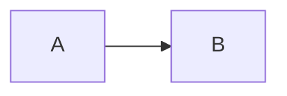
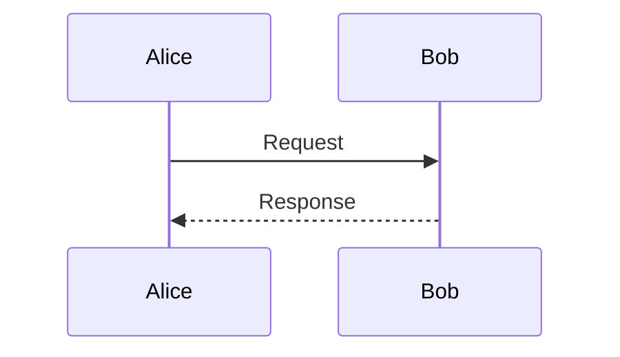

# Troubleshooting

## The app launches but no window appears

md2png is a menu bar accessory. It does not show a Dock icon or open a main
window at launch. Look for the md2png symbol in the macOS menu bar. If the menu
bar is crowded, check hidden menu bar items or temporarily quit another utility.

## A global shortcut does nothing

The default shortcuts are:

- Render: `Control-Command-X`
- Show Last Render: `Control-Command-Z`

Another utility can reserve the same system-wide combination. md2png shows a
local warning when registration fails; the equivalent menu bar commands remain
available. Choose **Settings…**, click the unavailable shortcut, and press a
different combination. Changes apply immediately; **Restore Defaults** returns
to the combinations above. The app does not require Accessibility permission
to record or use these hotkeys.

## The clipboard is empty or is not recognized as Markdown

The render command expects non-empty plain text on the clipboard. Copy the
Markdown again, open the md2png menu to confirm its compact preview, then render.
Images, files, and rich content without a plain-text representation are not
treated as Markdown input.

## A Mermaid diagram does not render

Use a `mermaid` code fence. Do not use the diagram type as the fence language:

````markdown

````

Flowcharts use node connections such as `A --> B`. Message syntax belongs to a
sequence diagram:

````markdown

````

For known-good inputs, choose **Examples → Flowchart**, **Sequence Diagram**, or
**Gantt Timeline** from the app. md2png uses the bundled Mermaid version and does
not load diagram plugins from the network.

After a Mermaid failure, the details dialog identifies the diagram number and a
nearby Markdown line when available. It also distinguishes an unsupported or
misspelled diagram type from other Mermaid syntax errors. Choose **Copy Error
Details** to copy a privacy-safe support summary; the Markdown and raw parser
message are never included.

## A code block has no expected highlighting

Add a recognized language after the opening fence, for example `swift`, `json`,
`python`, `javascript`, `typescript`, `sh`, `java`, `kotlin`, `cpp`, `go`, `rust`,
`sql`, `yaml`, `html`, or `css`. Unknown languages still render as code but may
use automatic or minimal highlighting.

## The result is too large

One clipboard image is limited to a logical size of 1600 × 16000 points. For a
tall result, keep the Markdown on the clipboard and choose **Save Clipboard as
Split PNGs…**. Select a parent folder; md2png creates a new folder containing
numbered PNGs and leaves the clipboard unchanged. It prefers boundaries between
blocks and avoids cutting fitting code blocks, Mermaid diagrams, and table rows.

Very wide tables and diagrams can still exceed the supported width, and an
extremely large document can exceed the bounded split-export budget. In those
cases, shorten the selection or export smaller sections separately. Tall results
that remain within the single-image limit are scrollable in Show Last Render.

## Show Last Render is blank or positioned oddly

First confirm that the success HUD appeared after rendering. **Show Last Render**
only becomes available after a successful render in the current app session.
Close the preview with `Command-W`, render again, and reopen it. Small images are
centered; **Fit** scales the image to the available width, while **Actual Size**
shows one PNG pixel per display backing pixel. Tall images begin at the top and
remain scrollable.

## A Last Markdown action is unavailable or asks for confirmation

**Re-render Last Markdown** and **Restore Last Markdown** become available only
after a successful render in the current app session. The source is kept in
memory and is intentionally discarded when md2png quits.

If another application or copy action changed the clipboard after md2png last
wrote it, md2png asks before replacing that newer content. Choose **Cancel** to
preserve the current clipboard, or **Replace** to continue with the latest
successful Markdown source.

## macOS says the app cannot be opened or verified

Use a notarized DMG from the project Releases page when a public binary release
is available, not an ad-hoc or Apple Development build copied from another Mac.
The distributed app requires macOS 14 or newer and Apple silicon.

## The update check in About fails

Open **About md2png** and confirm that the Mac can reach `github.com`, then use
**Try Again**. A corporate proxy, DNS filter, or temporary GitHub failure can
block the signed appcast or update archive. Manual checks allow at most one
request per 60 seconds. Opening About, launching md2png, and rendering never
start an update request on their own.

When an update is available, About shows its version and release notes.
**Download Update** starts download and signature verification; progress remains
inline until About reaches **Ready to Install**. Choose **Install and Relaunch**
to replace and restart the app, or **Later** to cancel the prepared install. If
the signed flow still fails, choose **View Releases**, download the notarized
DMG manually, and drag md2png into Applications. Never bypass a feed, archive,
or code-signature failure.

## Information to include in a bug report

Open **About md2png** and use the copy icon beside the version. Include that
diagnostic line, the smallest Markdown input that reproduces the issue, and a
screenshot when appropriate. Remove confidential message content before filing
a report.

For a renderer failure, first choose **About md2png → Diagnostics → Renderer
Self-Test**. It uses a bundled input and leaves the clipboard untouched. Include
whether the self-test passed. If an error-details dialog is visible, choose
**Copy Error Details** and include the copied summary.

For an intermittent failure, reproduce it and choose **About md2png →
Diagnostics → Save Diagnostic Logs…**. Select **Last Hour** unless the relevant
event is older, save the JSON, and attach it to the report manually. The export
contains privacy-safe operational metadata and version/system context; it does
not contain Markdown, clipboard payloads, rendered images, full paths, or raw
error messages. md2png never uploads the file automatically.

## Delete local diagnostic logs

md2png stores bounded, privacy-safe operational logs in
`~/Library/Logs/md2png/Diagnostics`. To remove them, quit md2png, choose
**Go > Go to Folder…** in Finder, enter `~/Library/Logs/md2png`, and delete the
`Diagnostics` folder. This does not affect clipboard contents, preferences, or
the installed application.
