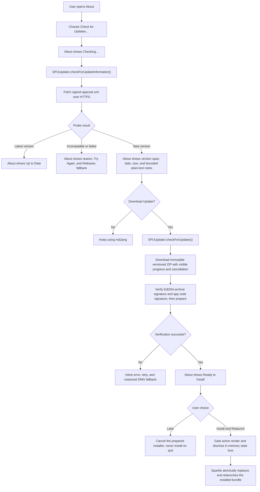

# Update architecture

md2png uses Sparkle 2.9.5 as the only production authority for update
discovery, archive verification, download, installation, and relaunch. A
custom `SPUUserDriver` projects Sparkle's state into About so release notes and
both user decisions stay in one window. No update request is made at launch,
when About opens, or on a timer.

## Runtime flow

## Components and release boundary

```mermaid
flowchart LR
    User["User"]
    subgraph App["md2png.app"]
      About["About window<br/>explicit trigger and inline status"]
      UpdateController["UpdateController<br/>cooldown and presentation state"]
      Driver["SparkleUpdateDriver<br/>coordinator adapter and delegate"]
      UserDriver["AboutSparkleUserDriver<br/>custom explicit choices"]
      Updater["SPUUpdater<br/>probe, download, verify, install"]
      About --> UpdateController --> Driver
      Driver --> UserDriver
      Driver --> Updater
      Updater --> UserDriver
    end
    subgraph Release["GitHub Release"]
      Appcast["appcast.xml<br/>signed feed metadata"]
      Archive["Versioned ZIP<br/>immutable signed update"]
      DMG["Versioned and latest DMG<br/>manual install and recovery"]
    end
    subgraph Pipeline["Trusted Release pipeline"]
      Build["Build and embed Sparkle.framework"]
      CodeSign["Existing Developer ID<br/>sign nested components and app"]
      Notarize["Apple notarization"]
      FeedSign["Protected EdDSA private key<br/>sign ZIP and appcast"]
      Verify["Public-key and artifact verification"]
      Publish["Publish exact six-asset contract"]
      Build --> CodeSign --> Notarize --> FeedSign --> Verify --> Publish
    end
    User --> About
    UserDriver --> About
    Updater -->|"HTTPS"| Appcast
    Appcast --> Archive
    Updater --> Archive
    DMG -.->|"Manual recovery"| User
    Publish --> Appcast
    Publish --> Archive
    Publish --> DMG
```

## Trust and recovery rules

- The existing Developer ID Application identity signs Sparkle's nested
  executables, framework, and `md2png.app`; no additional Apple certificate is
  required.
- A separate Ed25519 key signs the appcast and versioned ZIP. Only its public
  key is bundled. The private seed is held in the protected `release-signing`
  environment and an encrypted offline backup.
- Sandboxed XPC services are stripped because md2png is not sandboxed. The
  required `Autoupdate` and `Updater.app` helpers remain embedded and signed.
- Automatic checks, automatic downloads, automatic installation, and system
  profile submission are disabled. `SURequireSignedFeed` and
  `SUVerifyUpdateBeforeExtraction` fail closed.
- Release notes are read only from the signed appcast, capped to three
  versioned entries and rendered as bounded, non-interactive plain text. Raw
  HTML, images, script execution, and automatic link navigation are absent.
- The app records only the expected version immediately before the explicit
  install action. On the next launch it compares that marker with the running
  bundle, reports success or the real unchanged version once, and clears stale
  markers. Markdown, rendered pixels, and clipboard data are never persisted.
- Choosing **Later** sends Sparkle's cancellation response for the prepared
  installer. Closing About does the same, and a normal app termination waits
  for that cancellation to finish, so quitting cannot turn into an implicit
  install. A later explicit install request resumes through Sparkle. The app
  never keeps its own duplicate archive; Sparkle owns cleanup and may download
  the immutable ZIP again after a prepared installation is cancelled.
- `0.6.x` to `0.7.0` is a manual DMG migration. `0.7.0` must validate the first
  signed seamless update to a later test version before the path is announced.
- Published versioned ZIPs are immutable. Recover a bad release by publishing a
  higher fixed version. If feed or key trust is in doubt, stop seamless updates
  and use the notarized DMG; never downgrade verification policy.

Key setup, rotation constraints, release verification, and operator recovery
are documented in [Releasing md2png](RELEASING.md).
