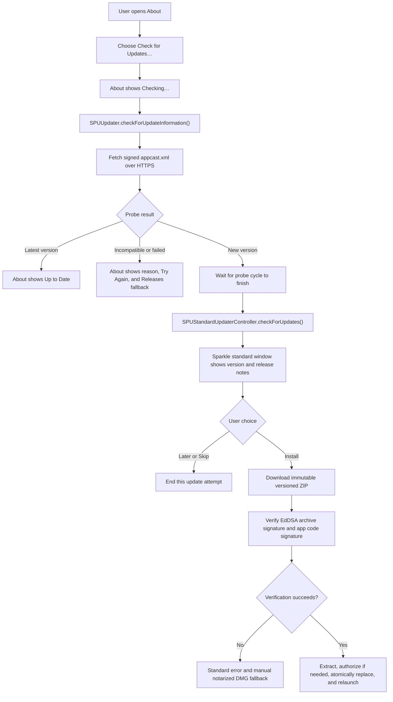

# Update architecture

md2png uses Sparkle 2.9.5 as the only production authority for update
discovery, archive verification, download, installation, and relaunch. About
owns only the explicit trigger and the inline result state. No update request
is made at launch, when About opens, or on a timer.

## Runtime flow

## Components and release boundary

```mermaid
flowchart LR
    User["User"]
    subgraph App["md2png.app"]
      About["About window<br/>explicit trigger and inline status"]
      UpdateController["UpdateController<br/>cooldown and presentation state"]
      Driver["SparkleUpdateDriver<br/>thin adapter and delegate"]
      StandardController["SPUStandardUpdaterController"]
      StandardUI["SPUStandardUserDriver<br/>standard update window"]
      Updater["SPUUpdater<br/>probe, download, verify, install"]
      About --> UpdateController --> Driver
      Driver --> StandardController
      StandardController --> StandardUI
      StandardController --> Updater
    end
    subgraph Release["GitHub Release"]
      Appcast["appcast.xml<br/>signed feed metadata"]
      Archive["Versioned ZIP<br/>immutable signed update"]
      DMG["Versioned and latest DMG<br/>manual install and recovery"]
    end
    subgraph Pipeline["Trusted Release pipeline"]
      Build["Build and embed Sparkle.framework"]
      CodeSign["Existing Developer ID<br/>sign nested components and app"]
      Notarize["Apple notarization"]
      FeedSign["Protected EdDSA private key<br/>sign ZIP and appcast"]
      Verify["Public-key and artifact verification"]
      Publish["Publish exact six-asset contract"]
      Build --> CodeSign --> Notarize --> FeedSign --> Verify --> Publish
    end
    User --> About
    StandardUI --> User
    Updater -->|"HTTPS"| Appcast
    Appcast --> Archive
    Updater --> Archive
    DMG -.->|"Manual recovery"| User
    Publish --> Appcast
    Publish --> Archive
    Publish --> DMG
```

## Trust and recovery rules

- The existing Developer ID Application identity signs Sparkle's nested
  executables, framework, and `md2png.app`; no additional Apple certificate is
  required.
- A separate Ed25519 key signs the appcast and versioned ZIP. Only its public
  key is bundled. The private seed is held in the protected `release-signing`
  environment and an encrypted offline backup.
- Sandboxed XPC services are stripped because md2png is not sandboxed. The
  required `Autoupdate` and `Updater.app` helpers remain embedded and signed.
- Automatic checks, automatic downloads, automatic installation, and system
  profile submission are disabled. `SURequireSignedFeed` and
  `SUVerifyUpdateBeforeExtraction` fail closed.
- `0.6.x` to `0.7.0` is a manual DMG migration. `0.7.0` must validate the first
  signed seamless update to a later test version before the path is announced.
- Published versioned ZIPs are immutable. Recover a bad release by publishing a
  higher fixed version. If feed or key trust is in doubt, stop seamless updates
  and use the notarized DMG; never downgrade verification policy.

Key setup, rotation constraints, release verification, and operator recovery
are documented in [Releasing md2png](RELEASING.md).
